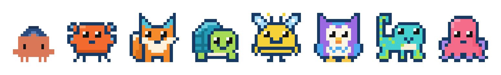
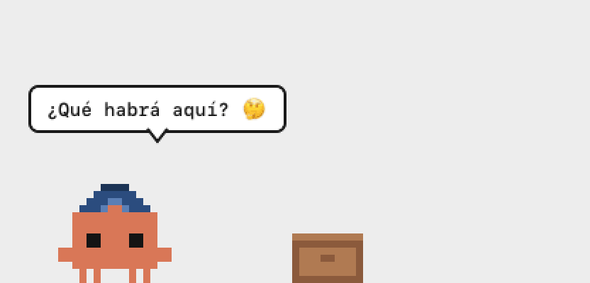
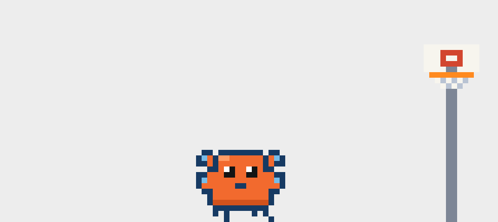

<div align="center">

# Maskot 🧢

**Una mascota de pixel art que vive en la parte de abajo de tu pantalla de macOS.**

Camina, lee en una banca, programa en su laptop, cocina pizza, baila, juega basket, hace magia,
se echa una siesta… y cuando llevas mucho rato sentado, te invita a estirar.




</div>

> **English:** Maskot is a tiny pixel-art desktop pet for macOS. It walks along the bottom
> of your screen, does 30+ little routines (reading, coding, cooking, sports, magic…),
> runs a Pomodoro timer with you and reminds you to stretch. 100% local, no network.
> The code and docs are in Spanish; contributions in either language are welcome.

---

<table>
<tr>
<td align="center"><br><sub>🪄 Mago</sub></td>
<td align="center"><br><sub>🏀 Basket</sub></td>
<td align="center"><br><sub>🍕 Cocinar pizza</sub></td>
</tr>
</table>

## Qué hace

- **Tranquila por diseño.** En un día de trabajo casi siempre está leyendo, programando o
  dormida en una esquina. Las gracias son la excepción, y nunca te interrumpe sin motivo.
- **No estorba.** Vive en una franja transparente sobre el Dock; el mouse pasa a través
  de ella, salvo justo encima de la mascota. No se puede arrastrar.
- **Clic para jugar.** Si le das clic salta y cambia de actividad (si dormía, se levanta).
- **Pomodoro 🍅.** Trabaja contigo: en los bloques de trabajo programa o lee, en los
  descansos se toma un tinto y tras 4 tomates se va a dormir 20 minutos. La barra de menú
  muestra cuánto falta. Formatos 25/5, 45/10 y 50/10.
- **Pausa activa real.** Si llevas 50 minutos usando teclado o mouse sin una pausa de 5,
  te guía en un estiramiento con cuenta regresiva para que lo imites. Solo le pregunta a
  macOS hace cuánto tocaste algo.
- **Una matica que crece.** De vez en cuando la riega, y cada día que usas el Mac está
  un poco más grande (de semilla a florecida en 30 días).
- **8 personajes.** Clawd y la familia Koru; se eligen desde el menú.

## Instalación

### Requisitos

- macOS 14 (Sonoma) o superior.
- Swift 6: viene con Xcode 16+ o con las Command Line Tools (`xcode-select --install`).

### Desde el código

```bash
git clone https://github.com/alecap92/maskot-mac.git
cd maskot-mac
./scripts/instalar.sh
```

El script compila en modo release, copia `Maskot.app` a `/Applications` y la abre.
Aparece un 🧢 en la barra de menú (no tiene ícono en el Dock).

¿Prefieres no instalarla? `./scripts/app.sh` la arma en `build/Maskot.app` y la abre desde
ahí, y `swift run Maskot` la corre directo en modo desarrollo.

### Abrirla al iniciar sesión

Ajustes del Sistema → General → Ítems de inicio → **+** → elige `Maskot`.

### Si macOS no la deja abrir

La app no está firmada con un certificado de Apple (se firma localmente al compilar).
Si la copiaste desde otro Mac y macOS la bloquea:

```bash
xattr -dr com.apple.quarantine /Applications/Maskot.app
```

### Desinstalar

```bash
rm -rf /Applications/Maskot.app
defaults delete io.maskot.mac   # borra sus preferencias (personaje elegido, días de la matica)
```

## Uso

Todo se maneja desde el 🧢 de la barra de menú:

| Opción | Qué hace |
|---|---|
| 🍅 Iniciar / Detener pomodoro | Arranca el ciclo de tomates; la barra muestra `🍅 18:42` |
| Duración del pomodoro | 25/5 (clásico), 45/10 o 50/10 (trabajo profundo) |
| Personaje | Cambia de mascota; recuerda tu elección |
| Rutinas | Lanza cualquier rutina a mano |
| Expresiones / Gorra | Para jugar con las caras |
| Dormir / Despertar · Ocultar / Mostrar | Para cuando necesites la pantalla limpia |

## API local

Maskot puede recibir órdenes de otros programas: un script, un cron, un atajo de
Raycast, n8n, Home Assistant o un agente de IA. Por ejemplo, que tu calendario le
pida avisarte de una reunión. Está **apagada por defecto**; se prende en
🧢 → **API local**:

| Modo | Escucha en | Token |
|---|---|---|
| Solo este Mac | `127.0.0.1:7777` | no |
| Red local | toda la LAN, puerto `7777`, anunciada por Bonjour | sí (`Authorization: Bearer …`) |

```bash
# Un aviso normal (salta y muestra el globo un rato)
curl -X POST http://127.0.0.1:7777/aviso -d '{"mensaje": "📅 Reunión con el equipo en 10 min"}'

# Uno urgente (brinca agitando los brazos)
curl -X POST http://127.0.0.1:7777/aviso -d '{"mensaje": "🚨 ¡La reunión empieza YA!", "urgente": true}'

# Desde otro equipo de la red, con token
curl -X POST http://mi-mac.local:7777/rutina \
  -H 'Authorization: Bearer <token>' -d '{"rutina": "Estiramiento"}'
```

| Endpoint | Cuerpo | Qué hace |
|---|---|---|
| `GET /estado` | | personaje, rutina actual, estado del pomodoro |
| `GET /rutinas` | | la lista de rutinas |
| `POST /aviso` | `{"mensaje", "urgente"?}` | aviso normal o urgente (interrumpe lo que esté haciendo) |
| `POST /decir` | `{"mensaje", "segundos"?}` | solo un globo, sin interrumpir |
| `POST /rutina` | `{"rutina"}` | hace esa rutina ya |
| `POST /pomodoro` | `{"accion": "iniciar" \| "detener"}` | controla el pomodoro |

**Varios Mac en la misma red:** cada Maskot en modo red local se anuncia por Bonjour
(`_maskot._tcp`) con el nombre de su equipo (se cambia en el menú). Quien envía los
avisos los descubre con `dns-sd -B _maskot._tcp` (macOS) o `avahi-browse -rt _maskot._tcp`
(Linux) y le escribe a uno o a todos. Para usar un solo token en todos tus Mac: *Copiar
token* en uno y *Pegar token* en los demás. El menú también copia un `curl` de ejemplo
listo para probar.

## Personajes

| | Personaje | Qué es |
|---|---|---|
| 🧢 | **Clawd** | Cangrejito terracota con gorra (personaje de fans, ver [Marcas](#marcas-y-créditos)) |
| 🦀 | **Koru** | El curioso: cangrejo explorador |
| 🦊 | **Tuno** | El ingenioso: zorro |
| 🐢 | **Nilo** | El confiable: tortuga |
| 🐝 | **Brio** | La eficiente: abeja |
| 🦉 | **Luma** | La observadora: búho |
| 🦎 | **Mako** | El ágil: gecko |
| 🐙 | **Orbi** | El versátil: pulpo |

La familia Koru comparte estilo, paleta y personalidades: ver
[`characters/FAMILIA.md`](characters/FAMILIA.md).

## Rutinas

| Grupo | Rutinas |
|---|---|
| Día a día | pasear, quedarse quieto, poner caras, voltear la gorra, asomarse por el borde, dormirse caminando, siesta, leer en la banca, dormir en la cama, echar código |
| Comida | tomar café, comer paleta o helado, cocinar pizza |
| Juegos | botar una hoja a la caneca, avión de papel, gym, bailar, mago, fútbol, basket, vóley, tenis |
| Aventura | excursión alrededor de la pantalla, binoculares, tomar fotos, fogata con malvaviscos |
| Hobbies | tocar guitarra, pescar, yoyo, selfie, leer el periódico |
| Calma | regar la matica, respiración guiada, estiramiento guiado (3…2…1, ¡imítame!) |
| Avisos | pomodoro, recordatorio urgente |

Los avisos de muestra (reunión, pedido nuevo…) son genéricos: todavía no leen ningún
calendario ni fuente real.

## Crear tu propio personaje o rutina

- **Personaje:** se dibuja con letras en una grilla de 16×16, una letra por color. Guía
  paso a paso en [`characters/README.md`](characters/README.md).
- **Rutina:** es una lista de acciones (`.irA`, `.cara`, `.decir`, `.objeto`, `.volar`,
  `.decorado`…). Mira [`CONTRIBUTING.md`](CONTRIBUTING.md) y los ejemplos en
  `Sources/Maskot/Rutinas*.swift`.

Para revisar cómo se ve sin tomar capturas de pantalla:

```bash
swift run Hoja                                         # hojas de poses → characters/<id>/hoja.png
MASKOT_FOTOS="Gym" swift run Maskot                    # simula una rutina → docs/fotos/Gym.png
MASKOT_FOTOS="Gym" MASKOT_PERSONAJE=brio swift run Maskot
MASKOT_FOTOS=Pomodoro swift run Maskot                 # un ciclo de pomodoro con bloques de segundos
MASKOT_DEMO="Botar una hoja" swift run Maskot          # arranca la app con esa rutina
```

La arquitectura está en [`CLAUDE.md`](CLAUDE.md).

## Privacidad

Maskot no se conecta a internet, no tiene telemetría y no pide permisos especiales. La
API local está apagada por defecto; en modo red local exige token y macOS te pedirá
permiso para aceptar conexiones entrantes.
Lo único que guarda es el personaje elegido y cuántos días la has usado, en las
preferencias locales de la app. La pausa activa solo consulta a macOS hace cuántos
segundos fue el último evento de teclado o mouse, sin registrar qué se tecleó.

## Contribuir

¡Bienvenidas las contribuciones, sobre todo personajes y rutinas nuevas! Lee
[`CONTRIBUTING.md`](CONTRIBUTING.md) antes de abrir un pull request.

## Licencia

[MIT](LICENSE) © 2026 Maskot contributors.

## Marcas y créditos

- **Clawd** es un personaje de fans inspirado en la mascota de Claude Code de
  [Anthropic](https://www.anthropic.com). Maskot **no está afiliado, patrocinado ni
  respaldado por Anthropic**. "Claude", "Claude Code" y sus mascotas son marcas de sus
  respectivos dueños. El sprite de este repositorio es una recreación hecha en código;
  si eres titular de los derechos y prefieres que se retire, abre un issue y lo quitamos.
- La **familia Koru** (Koru, Tuno, Nilo, Brio, Luma, Mako y Orbi) es original de este
  proyecto y se distribuye bajo la misma licencia MIT.
- Los nombres de marcas mencionados en textos o chistes de las rutinas pertenecen a sus
  dueños y se usan solo de forma descriptiva.
